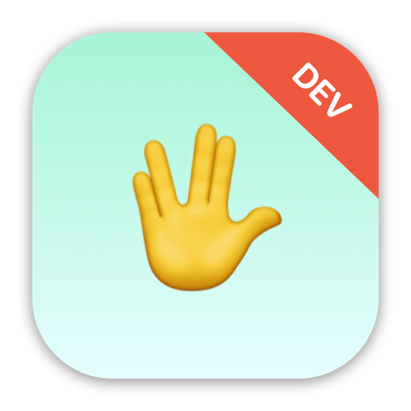

    

    
    
    

  ***Note**: The app icon above should only be used for development purposes only, not for submission to the App Store due to the license on SF Symbols and Emoji.*

 

RockPaperScissors is a brain training game app that challenges player to win or lose at rock, paper, scissors.

The app features only 1 view screen, which displays all the information of each game round that the player need to make their appropriate respond. These information include a randomly picked move by the app *(rock, paper, or scissors)*, the randomly generated game condition for the player *(to win or to lose the game)*, 3 buttons with emoji representing the rock, paper, scissors move that the player have to choose for their respond, and the total number of the player score.

After the player chose their answer, an alert prompt will show each round telling the player if their answer is correct or wrong, subsequently either awarding or reducing the player's score by 10 each round.

As for the maximum number of questions and score, the game has a total of 10 rounds of questions with a maximum score of 100 *(+10 for each round of correct answer)*, before restarting the game with a clean slate.

For example, if the app chose “Rock” and “Win” the player would need to choose “Paper”, but if the app chose “Rock” and “Lose” the player would need to choose “Scissors”.

For a more step-by-step example on how the game works:

* Each turn of the game the app will randomly pick either rock, paper, or scissors.
* Each turn the app will alternate between prompting the player to win or lose.
* The player must then tap the correct move to win or lose the game.
* If they are correct they score a point; otherwise they lose a point.
* The game ends after 10 questions, at which point their score is shown.

## Trying it yourself

RockPaperScissors is written using Xcode 13.2 and Swift 5.0. To try it out, you can clone this project and build it immediately by opening `RockPaperScissors.xcodeproj`.

As far as I know the app feature is complete, but there are likely to be errors all over the place at least to begin with – if you hit any problems, either building or running the app, please let me know.

## Important notes on usage

Keep in mind that this app is simply a project designed and built for my own personal educational purposes only. The sole purpose for this app project was to gain practical experience in building an app in iOS with Swift & SwiftUI. The state of this app was never meant to be production-ready, published onto the App Store, or to be monetized in any way, shape, or form.

If you wish to do any of the above, you will have to make some changes to the app before submitting to the App Store for approval. Please keep in mind of any potential violation of third-party license, such as the usage of SF Symbols and/or Emoji of the app icon.

## Credits

Swift, the Swift logo, Xcode, Instruments, SF Symbols, Emoji, Cocoa Touch, iPhone, iPad, Safari, App Store, watchOS, tvOS, Mac and macOS are trademarks of Apple Inc., registered in the U.S. and other countries.

## License 

This project is under the terms of the MIT license. For more information, please refer to the license [documentation](LICENSE).